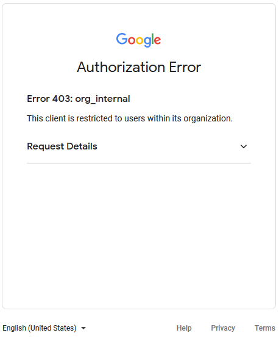

<h1 align="center">
  📦🔐 Verdaccio Google OAuth - With UI Support
</h1>

<p align="center">
  A Google OAuth Plugin for Verdaccio – <a href="https://www.verdaccio.org">https://www.verdaccio.org</a>
</p>

<p align="center">
  <a href="https://www.npmjs.com/package/verdaccio-google-oauth">
    
  </a>
  <a href="https://raw.githubusercontent.com/edydeleon/verdaccio-google-oauth/master/LICENSE">
    
  </a>
  <a href="https://github.com/edydeleon/verdaccio-google-oauth/issues/new/choose">
    
  </a>
</p>

## About


This is a Verdaccio plugin that offers Google OAuth integration for both the browser and the command line.

Thanks to https://github.com/n4bb12/verdaccio-github-oauth-ui for most of the original work on this!

### Features

- The Verdaccio login button redirects you to Google instead of showing a login form. Logout works, too.
- The usage info is updated for use with Google OAuth.
- A built-in command-line tool helps you configure npm.

### Compatibility

- Verdaccio 5
- Node 14, 16
- Chrome, Firefox, Firefox ESR, Edge, Safari

## Setup

### Install

```
$ npm install verdaccio-google-oauth
```

### Google Credentials Config

- Create a developer project at https://console.developers.google.com
- Configure the OAuth consent screen and create a set of OAuth credentials
- The callback URL should be `YOUR_REGISTRY_URL/-/oauth/callback`

Example:


### Verdaccio Config

Merge the below options with your existing Verdaccio config:

```yml
middlewares:
  google-oauth:
    enabled: true

auth:
  google-oauth:
    client-id: GOOGLE_CLIENT_ID
    client-secret: GOOGLE_CLIENT_SECRET
    domain: "gmail.com"
```

#### Using environment variables

The plugin options can be actual values or the names of environment variables containing the values.

For example, either of the below will work:

- `client-id: abc`
- `client-id: GOOGLE_CLIENT_ID` and set an environment variable `GOOGLE_CLIENT_ID=abc`.

The environment variable names can be freely chosen. The above is just an example.

#### `client-id` and `client-secret` (required, string)

These values can be obtained from the Google Credentials page at https://console.developers.google.com/apis/credentials.

#### `domain` (required, string)

Users with this domain will be able to authenticate.

All others will be denied access.



### Proxy Config

If you are behind a proxy server, the plugin needs to know the proxy server to make Google requests.

Configure the below environment variable.

```
$ export GLOBAL_AGENT_HTTP_PROXY=http://127.0.0.1:8080
```

See the [global-agent](https://github.com/gajus/global-agent#environment-variables) docs for detailed configuration instrcutions.

## Login

### Verdaccio UI

- Click the login button and get redirected to Google.
- Authorize the registry to access your Google user.
  You only need to do this once.
- Once completed, you'll be redirected back to Verdaccio.
- You are now logged in 🎉.

### Command Line

#### Option A) Use the built-in CLI

The easiest way to configure npm is to use this short command:

```
$ npx verdaccio-google-oauth --registry http://localhost:4873
```

#### Option B) Copy commands from the UI

- Verdaccio 5:

Open the "Register Info" dialog and click "Copy to clipboard":


- Run the copied commands on your terminal:

```
$ npm config set //localhost:4873:_authToken "SECRET_TOKEN"
$ npm config set //localhost:4873:always-auth true
```

- Verify npm is set up correctly by running the `whoami` command. Example:

```
$ npm whoami --registry http://localhost:4873
user@gmail.com
```

If you see your Google username, you are ready to start installing and
publishing packages.

## Logout

### Verdaccio UI

Click the <kbd>Logout</kbd> button as per usual.

### Command Line

Unless OAuth access is revoked in the Google settings, the token is valid
indefinitely.
